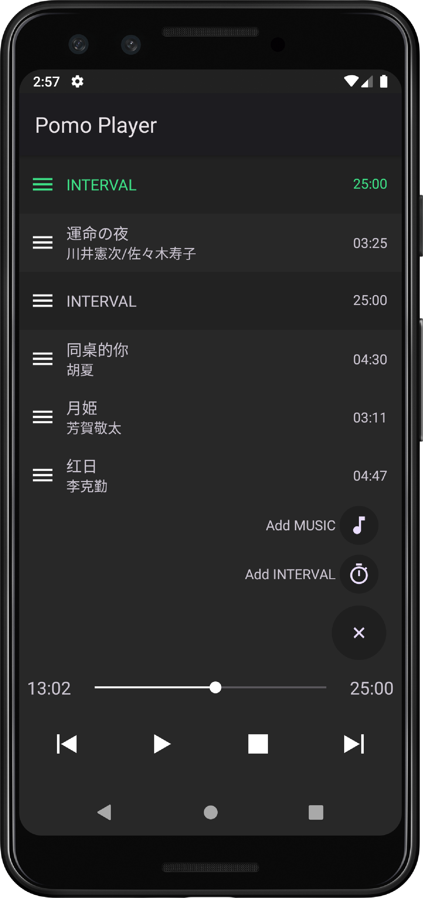

<div align="center">

</div>
<h3 align="center">Pomo Player</h3>
<p align="center">An Android mp3 player help you practice Pomodoro Technique</p>

## About
<!--  -->

<p>I would like to create a simple mp3 player with INTERVAL between each song to practice Pomodore Technique Technically and also learn and practice Android development skills. As my first Android app, technically, this app only has two function, one is play local mp3 file and the other one is play a 25 minutes interval.</p>

## Getting Started
Feel free to fork or pull request to add on or fix bugs. There only one place to modify before you run it. Please modify the path of music dic to your local music folder.
```
src\java\res\values\strings.xml
```

## Update Log
#### Updated
- Add wake lock.
- Save and read last playing index and progress.
#### Todo
- Choose local music folder.
- Click and play.

## Reference
#### Wake lock
- https://developer.android.com/training/scheduling/wakelock?hl=zh-cn#java
- https://blog.csdn.net/wzj0808/article/details/52608940
- https://blog.csdn.net/feitukejihui/article/details/100020637
- https://stackoverflow.com/questions/39954822/battery-optimizations-wakelocks-on-huawei-emui-4-0
#### SharedPreferences
- https://developer.android.com/reference/android/content/SharedPreferences
- https://www.jianshu.com/p/540e44f00d3e
- https://stackoverflow.com/questions/10614696/how-to-pass-parameters-to-onclicklistener
#### When to save data
- https://stackoverflow.com/questions/9186769/android-save-game-state-in-onpause-or-ondestroy
- https://stackoverflow.com/questions/13956528/save-data-in-activitys-ondestroy-method